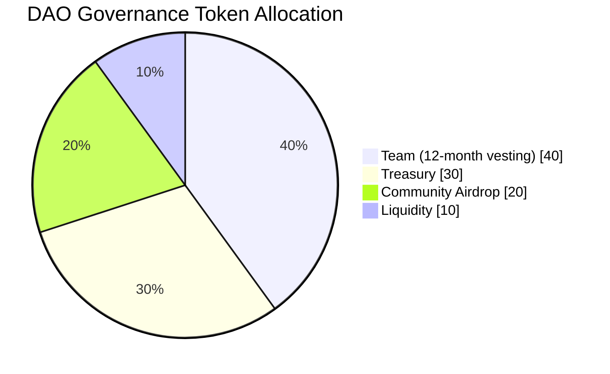

# Governance Token Distribution

Total supply: `1,000,000 DGT`

## Breakdown

| Bucket | Percentage | Amount |
| --- | ---: | ---: |
| Team vesting wallet | 40% | 400,000 DGT |
| DAO treasury | 30% | 300,000 DGT |
| Community airdrop | 20% | 200,000 DGT |
| Liquidity | 10% | 100,000 DGT |

## Implementation Notes

- The token contract mints the full supply at deployment.
- Team allocation is minted directly to `TokenVesting`.
- Treasury allocation is minted directly to `Treasury`.
- Community and liquidity allocations are minted directly to their configured addresses.
